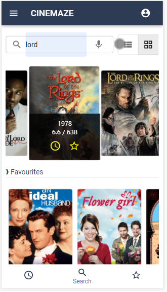

# CINEMAZE

A portal to the **amazing** world of **Cinema!** Cinema + Maz + e = Cinemaze

## Description

CINEMAZE is a great react.js app which is designed as Mobile-First approach and this means it work perfectly on mobile/tablets. using this app you can find annything you want. TV shows, movies, Actors/Actresses, movies posters, trailer videos and comprehensive detailed information. You are able to create your own favourites list and also select some movies and add them to a watch later list.
This app powered by : [themoviedb.org](https://api.themoviedb.org)

## Demo

### Live Demo

[khaledr.ir](https://khaledr.ir)

## Demo snapshots




## Getting Started

## Stack

<div align="center">
<a href="https://reactjs.org/" title="React"></a>
<a href="https://www.typescriptlang.org/" title="Typescript"></a>
<a href="https://redux.js.org/" title="redux"></a>
<a href="https://developer.mozilla.org/en-US/docs/Web/JavaScript" title="JavaScript"></a>
<a href="https://material-ui.com/" title="Material UI"></a>
<a href="https://git-scm.com/" title="Git"></a>
<a href="https://www.npmjs.com/" title="npm"></a>
<a href="https://yarnpkg.com/" title="Yarn"></a>
<a href="https://webpack.js.org/" title="webpack"></a>
<a href="https://eslint.org/" title="ESLint"></a>
<a href="https://prettier.io/" title="Prettier"></a>
<a href="https://jestjs.io/" title="Jest"></a>
<a href="https://github.com/enzymejs/enzyme" title="Enzyme"></a>
<a href="https://www.cypress.io/" title="Cypress"></a>
<a href="https://code.visualstudio.com/" title="Visual Studio Code"></a>
<a href="https://www.firebase.com/" title="Firebase"></a>
</div>

## Overview


Designed with [Balsamiq.com](https://balsamiq.com)

## Approches & Structure


### Components tree & State map

```
**App**
|
|---MainPage
|   |
|   |---SearchArea
|   |
|   |---MovieList
|   |   |
|   |   |---MovieItem
|   |
|---FavoritesPage
|
|---WatchLaterPage
|
|---MoviDetails(Modal)
|
|---SignInUpPage
|   |
|   |---SignIn
|   |
|   |---Signup
|   |
```

This app uses js debouncing technique so as the user types search functionality runs without need for submit.

### Installing Dependencies

```
npm install
```

```
yarn
```

### Build & Run

```
npm run build
npm start
```

```
yarn build
yarn start
```

#### Test

Do not follow the happy path! be prepared for worst case senario.

- Unit Test
  - Run `yarn test` to execute the unit tests.
- E2E Test
  - Run `cy` to execute the e2e test.

## Help

In case of any issues please contact me at: info@khaledr.ir

## Authors

[Khaled Rakhisi](https://www.linkedin.com/in/khaledrakhisi/)

## Version History

- 0.1
  - Initial Release

## License

This project is licensed under the [Khaled Rakhisi] License - see the LICENSE.md file for details

## Acknowledgments

Inspiration, code snippets, etc.

- [awesome-readme](https://github.com/matiassingers/awesome-readme)
- [PurpleBooth](https://gist.github.com/PurpleBooth/109311bb0361f32d87a2)
- [dbader](https://github.com/dbader/readme-template)
- [zenorocha](https://gist.github.com/zenorocha/4526327)
- [fvcproductions](https://gist.github.com/fvcproductions/1bfc2d4aecb01a834b46)
